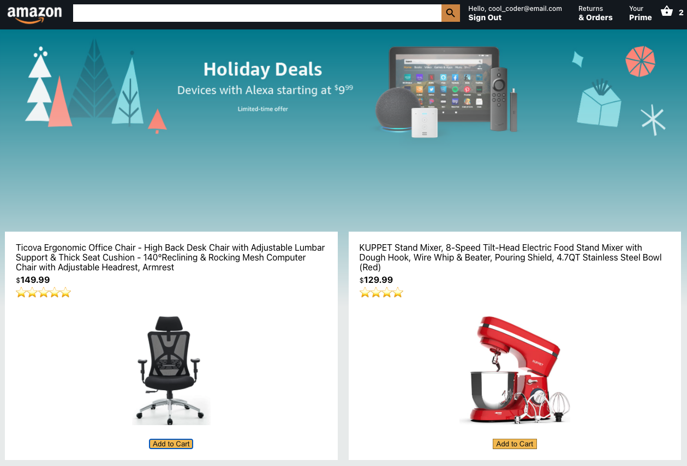

# Amazon Clone

## Description

Shop for popular amazon products with this amazon clone application. Some key features are adding items to cart, removing items from cart, processing payments, and viewing order history. This application was built using React.js, Firebase for data storage and user authentication, Stripe for payment processing, Material UI for styling, Context API to manage state, and heroku for web hosting. 

## Table of Contents

- [Description](#description)
- [Technology](#technology)
- [User Story](#user-story)
- [Installation](#installation)
- [Usage](#usage)
- [License](#license)
- [Contributing](#contributing)
- [Tests](#tests)
- [Questions](#questions)
- [Deployed Application URL](#deployed-application-URL)

## Technology

- React.js
- Firebase
- React Hooks
- Context API(redux)
- Express
- Node.js
- JavaScript
- CSS
- HTML
- Stripe
- React Router
- axios
- Heroku

## User Story

## Installation

NPM install in root folder to install dependancies for backend and frontend.

## Usage

The deployed link will take you to the homepage. On the homepage, click on sign up to create and account or sign in to log in an existing account. You can log using the credentials below. Click on add to cart to add items to cart. Click on the cart icon to view your cart. On the cart page, you can remove items from your cart or proceed to checkout. On the checkout page, review your order and fill out your payment info using the test credit card provided.

Public Login Credentials

email: cool_coder@email.com
password: 123456

## License

## Contributing

Please follow standard contributing guidelines.

## Tests

No tests to run.

## Questions

For any questions, please contact kendayao at kendayao@gmail.com

## Deployed Application URL

Deployed application link: https://amazon-twin-app.herokuapp.com/ 

